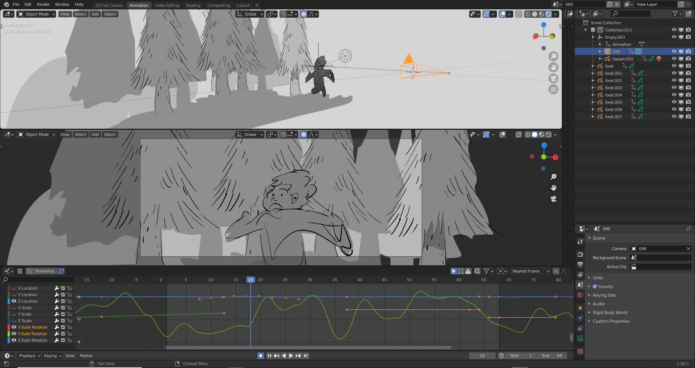
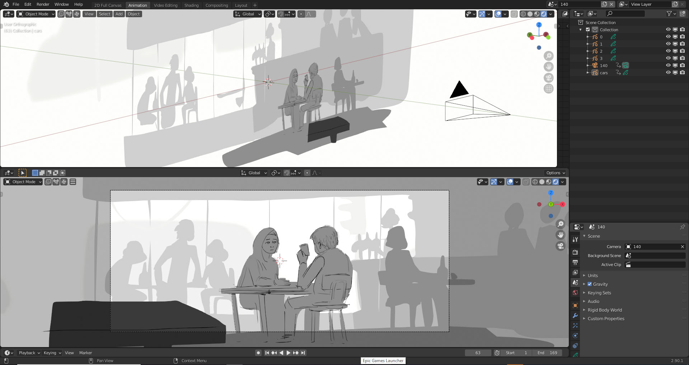
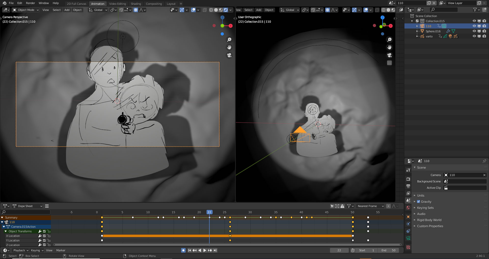
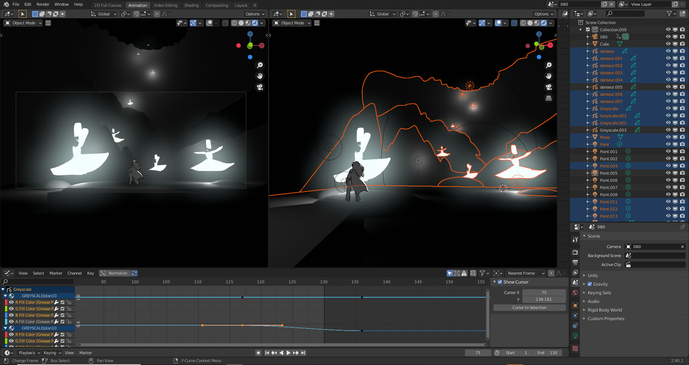

# Concept Art - Storyboard 3D

 - Source: https://www.blender.org/user-stories/the-future-of-storyboarding-blender-for-pre-production/
    - Modern storyboard artist choices:
        - The basis for the whole production
        - Grease Pencil with low poly assets
        - 2D animation against a 3D environment
        - An accurate representation of a 3D world
        - “I’m pushing a way of working where we do a first pass in Blender, using only low-poly characters and environments. Plus some basic rendering in EEVEE, and a bit of rigging. Basically, staging each scene in Blender to get a feel for it. Then capturing stills of these 3D images and using them as the basis for more refined 2D art. Which in turn fuels the more traditional 3D part of the production.”
        - An advanced form of pre-visualization
        - This technique delivers the most value in action sequences, where space and camera movement are paramount.
    - Example of hybrid 2D/3D storyboarding
        - https://vimeo.com/478816885
        - Images source: https://www.blender.org/user-stories/the-future-of-storyboarding-blender-for-pre-production/
        - 
        - 
        - 
        - 
        - 
        
    - Tips:
        - For lines in Grease Pencil, Alex keeps it simple. “A storyboarder’s work will always be replaced with a 3D image, so I stick to basics. The pencil tool is more than enough for what I need.” In fact, Alex considers the pencil tool so good, he’ll be using it in the final version of Maryam & Varto. Alex: “Those Grease Pencil lines will be on screen. The line and the render will all be Grease Pencil.” 
        - Alex likes the shadow effects created by Grease Pencil materials. “When you bring a light into the face of a character, you get this nice soft shadow. It looks amazing. It’s not flat anymore.”
        - He’s a big fan of the sculpting brush, and not just for refining lines. “I’m using this constantly. You can use it to create squash and stretch. In fact, you can pretty much re-pose a character this way.”
        - Because storyboarding relies on speed, Alex animates Grease Pencil objects in minimal ways. “For instance, if I’m animating a character walking, I’ll animate the Grease Pencil object along its axis, with ups and downs, as the basis for the walk cycle. Which means I have to draw less. You can get a lot of expressivity out of just animating this one drawing.” 
    - Tutorials:
        - https://www.youtube.com/@SpitfireStoryboards
        - https://vimeo.com/user2104760

- Dynamic Storyboard (construído depois de se alcançar todas as reflexões técnicas anteriores)
    - Interpretação visual, dinâmica e 3D do roteiro textual, com certa destreza no desenho devido o design gráfico feito anteriormente em quadros.
    - Sequência de desenhos e acontecimentos, tentando englobar todo a produção audiovisual.
    - Uso de Grease Pencil with Low Poly Assets 3D.
    - Uso de animação 2D em Ambiente 3D.
    - Representação inicial e incompleta, mas funcional, do ambiente 3D.
    - Um pouco de rigging, se necessário.
    - Uma forma avançada de pré-visualização, onde já se concebe, mesmo que de forma simples, o espaço e o movimento de câmeras.
    - Já se pode fazer enquadramento do personagem, no ambiente 3D.
        - Expressão do personagem
        - Proximidade do personagem
        - Posiçnao do rosto e das mãos do personagem
    - Deve-se documentar o trabalho desenvolvido, para utilização em outras etapas do projeto ou para a manutenção do projeto.
    