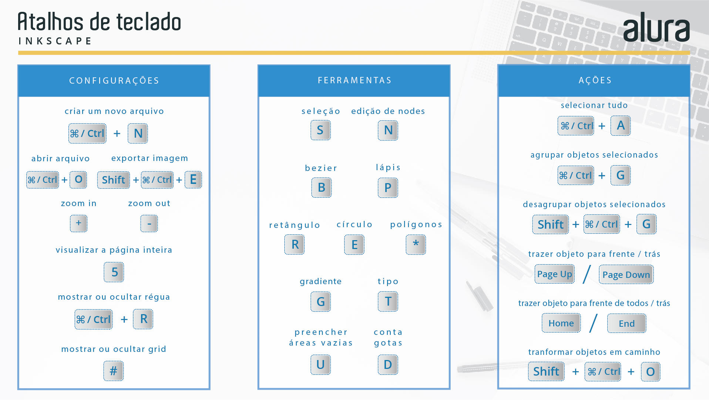

# Concept Art - Cinematic

 - Source: https://www.blender.org/user-stories/the-future-of-storyboarding-blender-for-pre-production/
    - Modern storyboard artist choices:
        - The basis for the whole production
        - Grease Pencil with low poly assets
        - 2D animation against a 3D environment
        - An accurate representation of a 3D world
        - “I’m pushing a way of working where we do a first pass in Blender, using only low-poly characters and environments. Plus some basic rendering in EEVEE, and a bit of rigging. Basically, staging each scene in Blender to get a feel for it. Then capturing stills of these 3D images and using them as the basis for more refined 2D art. Which in turn fuels the more traditional 3D part of the production.”
        - An advanced form of pre-visualization
        - This technique delivers the most value in action sequences, where space and camera movement are paramount.
    - Example of hybrid 2D/3D storyboarding
        - https://vimeo.com/478816885
        - Images source: https://www.blender.org/user-stories/the-future-of-storyboarding-blender-for-pre-production/
        - 
        - 
        - 
        - 
        - 
        
    - Tips:
        - For lines in Grease Pencil, Alex keeps it simple. “A storyboarder’s work will always be replaced with a 3D image, so I stick to basics. The pencil tool is more than enough for what I need.” In fact, Alex considers the pencil tool so good, he’ll be using it in the final version of Maryam & Varto. Alex: “Those Grease Pencil lines will be on screen. The line and the render will all be Grease Pencil.” 
        - Alex likes the shadow effects created by Grease Pencil materials. “When you bring a light into the face of a character, you get this nice soft shadow. It looks amazing. It’s not flat anymore.”
        - He’s a big fan of the sculpting brush, and not just for refining lines. “I’m using this constantly. You can use it to create squash and stretch. In fact, you can pretty much re-pose a character this way.”
        - Because storyboarding relies on speed, Alex animates Grease Pencil objects in minimal ways. “For instance, if I’m animating a character walking, I’ll animate the Grease Pencil object along its axis, with ups and downs, as the basis for the walk cycle. Which means I have to draw less. You can get a lot of expressivity out of just animating this one drawing.” 
    - Tutorials:
        - https://www.youtube.com/@SpitfireStoryboards
        - https://vimeo.com/user2104760

- Cinematic
        - Sequenciamento do storyborad em vídeo
            - Quantificação do tempo
            - Quantificação do ritmo
            - Estudo do movimento da câmera
    - Gravação de vozes
        - Em paralelo com o animatic
    - Colour Script e Design da Iluminação
        - Planejar o uso de cores no projeto e em cada cena.
        - Uso de cores quentes para cenas mais itensas
        - Uso de cores pastel/simpls/opaca para cenas mais monótonas
        - Definir referencial para iluminadores e texturizadores.
- Modelagem
    - Inclusão de imagem no background
    - Modelagem com poucos polígonos
- Rigging
- Melhoria da Modelagem
- Melhoria do Rigging
- Shading
- Animation
- Rendering

Arquivo blender armazenado em :….

Concept Art (Storyboard 3D)

## Cores
- OpenColorIO
- Color SPACE:
    - ACES2065-1 (AP0 primaries)
        - ACES2065-1 can also seen by the name AP0. It has the widest gamut of all the ACES colorspaces fully encompassing the entire visible spectrum. You will almost never work in this colorspace it is meant primarily to be a transfer and archival format. Typically, this is the colorspace you would use to transfer images/animations between production studios.
    - ACEScg (AP1 primaries)
        - ACEScg is the colorspace a CG artist will be using. It is "scene-referred" or linear. It doesn't have as wide a color gamut as ASES2065-1 but it is far larger than most other colorspaces one might use and has an enormous dynamic range.
    - ACEScc & ACEScct (AP1 primaries)
        - ACEScc and ACEScct are primarily used for color grading. This is not a linear colorspace and maps black at 0 and white at 1. ACEScct is similar to ACEScc except it has a "toe" or a gamma curve in the dark values of the image. This allows grading/editing software to behave and feel like it did while working in other colorspaces making some colorists very happy.
    - ACESproxy (AP1 primaries)
        - ACESproxy is primarily used for camera playback and video displays. Like ACEScc and ACEScct, ACESproxy has a non-linear transform function and maps black at 0 and white at 1.
- Colour Modes:
    - HSV or HSL
        - Hue is a colour component. Since the cone represents the HSV model, the hue represents different colours in different angle ranges. 
            - Red colour falls between 0 and 60 degrees in the HSV cone.
            - Yellow colour falls between 61 and 120 degrees in the HSV cone.
            - Green colour falls between 121 and 180 degrees in the HSV cone.
            - Cyan colour falls between 181 and 240 degrees in the HSV cone.
            - Blue colour falls between 241 and 300 degrees in the HSV cone.
            - Magenta colour falls between 301 and 360 degrees in the HSV cone.
        - Saturation as the name suggest describes the percentage of the colour. Sometimes this value lies in the 0 to 1 range. 0 being the grey and 1 being the primary colour. Saturation describes the grey colour.
        - The value (or lightness) represents the intensity of the colour chosen. Its value lies in percentage from 0 to 100. 0 is black and 1 is the brightest and reveals the colour. 
    - RGB:
        - Red (0 to 255)
        - Green (0 to 255)
        - Blue (0 to 255)
- Image Format
    - OpenEXR
- Definição:
    - Por padrão, uma imagem vetorial possui definição de 72 DPI (dots per inche). Mas este número pode não representar a qualidade de uma imagem devido o tamanho da imagem.
    - Uma imagem impressa é gerada a partir de pontos sobrepostos nas cores ciano, amarelo, magenta e preto (CYMK). Outdoors podem ter resolução de 150 DPI.

- 
    - Fonte: curso Alura: Inkscape e identidade visual

- Fontes:
    - Typekit
    - Fontdeck
    - Google Fonts

### Análise de Cores:
- o uso incorreto das cores pode levar ao desconforto e à fadiga visual, causando uma percepção errada da mensagem.
- se a mensagem fosse monocromática, por exemplo, teria um terço de redução desse impacto.
- O olho humano é um sistema de percepção de três tipos de células, chamado de sistema tricromático. É por isso que somos aptos a identificar as três cores primárias em luz e pigmento. Quando estimulamos apenas um tipo de cone, por determinado tempo, ocorre uma espécie de saturação, causando a sensação de enxergarmos a cor complementar àquela observada.
- Cores Quentes:
    - São as mais dinâmicas e estimulantes e geralmente associadas ao calor, vitalidade, excitação, alegria e movimento.
    - No design de interiores, as cores quentes costumam ser usadas em grandes
salas para criar um ambiente mais acolhedor;
    - Vermelho: Associações mais comuns: energia, poder, paixão e amor. Comum em companhias áreas, empresas automobilísticas e alimentos.
        - #A31F08 Vermelhor Dividir complementar
        - #A32610 Vermelhor Dividir complementar 2 vezes
        
    - Amarelo: Alegria e otimismo. Muito utilizada por restaurantes fast food e alimentos, por vezes em conjunto com o vermelho.
        - Significado cultural: egoísmo, ciúmes, inveja, prazer, conforto, alerta, esperança, flores grandes, verão, limão, calor da luz solar, iluminação, alerta, euforia.
        - Significado simbólico: uma cor essencialmente material e terrestre, uma cor fascinante e extravagante, uma explosão de energia, um des-perdiçar das forças.
- Cores Frias: São tidas como estáticas e suaves, podem passar a mensagem de calma e tranquilidade. Além disso, são relacionadas ao frio, água e gelo.
    - Esses naturalmente evocam um sentimento mais calmo do que as outras cores, são mais subjugados do que as cores mais quentes, ligando-se mais de perto à água, à natureza etc.
    - Azul: Confiabilidade, segurança, tranquilidade e serenidade. Empresas de tecnologia que trabalham com informação costumam adotá-la.
        - #2B10A3  Tríade
        - #1044A3 Quadrado
        - Significado cultural: frio, mar, céu, horizonte, feminilidade, espaço, intelectualidade, paz, serenidade, fidelidade, confiança, harmonia, afeto, amizade, amor, viagem, verdade, advertência.
        - Significado simbólico: uma cor imaterial, capaz de despertar no ser humano um profundo desejo de pureza e de contato com o divino.
    - Verde: Natureza, esperança, saúde, vitalidade e juventude.
        - #00A300 Base
       
- Neutras: Compreende os tons pastéis e pouco saturados, que refletem pouca luz, e como diz o nome, não estão diretamente ligadas às sensações opostas das quentes e frias.
    - Cinza: Estabilidade, solidez e sofisticação.
    - Marrom claro: #A35110  Tríade
    - Marrom escuro: #572804  Tríade

São cores primárias da luz, porque a soma dessas três resulta na luz branca. A síntese aditiva ocorre a partir de três diferentes conjuntos, que correspondem àqueles que estimulam cada um dos três tipos de receptores da retina humana: vermelho (red, em inglês, composto pelas ondas longas da luz), verde (green, em inglês, composto pelas ondas médias) e azul (blue, em inglês, composto pelas ondas curtas).

Base:

- Red: #FF0000 com complementar 
    - Significado cultural: guerra, sol, fogo, atenção, mulher, conquista, coragem, furor, vigor, glória, ira, emoção, paixão, ação, agressividade, perigo, dinamismo, baixeza, energia, revolta, calor, violência.
    - Significado simbólico: o vermelho é a cor autoconfiante, transbordante de vida, ardente, agitada, efervescente. Ao misturar-se com o preto, adquire a cor marrom, que se classifica como uma cor dura, estagnada, quase sem vida. No entanto, o marrom também é uma cor potente, na sua sonoridade interior, capaz de expressar uma beleza interior que não pode ser traduzida em palavras.
    - Associações mais comuns: energia, poder, paixão e amor.
- Green: #00FF00
    - Significado cultural: umidade, frescor, bosque, mar, verão, adolescência, bem-estar, paz, saúde (medicina), esperança, liberdade, paz repousante. Pode desencadear paixões.
    - Significado simbólico: é a cor mais calma entre todas as cores. Representa passividade saudável, repleta satisfação, é tonificante e representa a cor da natureza em seu movimento de maior vitalidade e exuberância
- Blue: #0000FF

Black: #000000
White: #FFFFFF

- Tecnicamente, harmonia cromática é o resultado do equilíbrio entre a cor dominante (que possui a maior extensão na composição), a cor tônica (coloração vibrante que dá tom ao conjunto) e a cor intermediária (meio-termo entre a dominante e a tônica). 
- Todas as cores podem ser combinadas, o que não significa que o resultado será harmônico. Para que isso ocorra, deve-se buscar o resultado que proporcione maior conforto visual, arranjando as cores como um músico faz com as notas musicais. Daí a semelhança terminológica entre a teoria musical e a cromática. O estudo da harmonia não deve ser entendido como um limitador, mas sim como um aliado, que fornece o conhecimento necessário para obter resultados melhores e até mesmo inusitados.

## Harmonia Monocromática:

#### Azul 
- #000080
- #4D4DFF
- #0000FF (Base)
- #262680
- #0000CC

#### GREEN 
- #008000
- #4DFF4D
- #00FF00 (Base)
- #268026
- #00CC00

#### RED 
- #800000
- #FF4D4D
- #FF0000 (Base)
- #802626
- #CC0000

## Harmonia Complementar
- É a harmonia que ocorre quando combinamos cores opostas no círculo cromático. Em outras palavras, são cores que se encontram simétricas com respeito ao centro do círculo. O matiz varia em 180° entre um e outro.
- Esta harmonia funciona ainda melhor se são combinadas cores frias e cores quentes, por exemplo, vermelho com verde com azul ou azul com amarelo.
- Uma harmonia complementar é intrinsecamente uma harmonia de contraste.
- Quando utilizar esta harmonia, é importante escolher uma cor dominante e utilizar a complementar para acentos e toques de destaque — por exemplo, utilizar uma cor para fundo e a outra para destacar os elementos de importância.
- Cor dominante: Vermelho
    - Cor complementar ao vermelho: verde 
    - Frente: Vermelhão no Outdoor e nas paredes.
    - Verde na propaganda, e na grade.
- Cor dominante: azul
    - Cor complementar ao azul: amarelo
    - Azul em todas as paredes internas.
    - Amarelo em imagens e na moldura de imagens.
# Red com complementar GREEN
- #B30000 Vermelho escuro
- #FF1919
- #FF0000 Base Vermelha
- #00B333 Verde pouco escuro
- #00FF48 Verde Claro
# GREEN com complementar RED
- #00B300 Verde  ->>>   PAREDES EXTERNAS DO LOTE > GRADES > MESANINO
- #19FF19
- #00FF00 Base Verde
- #B30059 Vermelho ->>> Moldura da Propaganda
- #FF0080 Espera ver rosa
# Blue com complementar Amarelo
- Mas complementar principal deve ser BRANCO
- #0000B3 Azul escuro
- #1919FF Azul mais escuro   `Porta de banheiros`
- #0000FF Base Azul    `Piscina`
- #B39200 Amarelo pouco escuro  `Parede banheiros`
- #FFD100 Amarelo Claro  `Textos`
- Coral:
    - Azul Segurança
    - Lua do Sertão
    - Azul Profundo
    - Azul França   `Preferência`
    - Azul Del Rey
- Parede Externa Fosco
    - https://www.coral.com.br/pt/produtos/prote%C3%A7%C3%A3o-sol-chuva-acr%C3%ADlico-total
    - Acabamento: Fosco
    - Tinta desenvolvida especialmente para paredes externas, que proporciona elevada proteção e resistência às superfícies, além de entregar mais cobertura, ação anti algas, mofo e durabilidade para suas cores.
    - Possui maior cobertura, resistência e ação antialgas. Rende até 150 m² acabados por embalagem de 18L.
    - Rolo de lã de pelo baixo, pincel de cerdas macias.
- Parede Externa Eggshell:
    - https://www.coral.com.br/pt/produtos/prote%C3%A7%C3%A3o-sol-chuva-pintura-impermeabilizante
    - Acabamento EggShell
    - Azul Profundo
    - 16L
    - Rolo de lã de pelo baixo, pincel de cerdas macias.

## Harmonia Triádica 
- Nesta harmonia utilizamos três cores equidistantes no círculo cromático.
- Por exemplo, azul, amarelo e vermelho.
- Esse tipo de combinação consegue dar um efeito visual muito atraente.
- Esta harmonia é muito popular entre os artistas, porque oferece um alto contraste visual, ao mesmo tempo em que conserva o equilíbrio e a riqueza das cores.
- Esta harmonia não é tão contrastante como o esquema de complementares, mas é mais equilibrada e harmoniosa.

## Harmonia Dupla Complementar
- Estas combinações são as mais ricas de todas as harmonias, porque utiliza quatro cores sendo elas complementares em pares.
- É, no entanto, uma harmonia muito difícil de trabalhar.
- Uma dica que vale para todas as harmonias é evitar o uso de todas as cores com o mesmo peso.
- Deixe uma cor como dominante e as outras cores em menor escala para detalhes.
Dominante: Verde

Azul dominante:
- Azul Profundo  
#006F9A

Verde Angra:
The hexadecimal color code #7eb293 is a shade of green-cyan.
In the RGB color model #7eb293 is comprised of 49.41% red, 69.8% green and 57.65% blue. In the HSL color space #7eb293 has a hue of 144° (degrees), 25% saturation and 60% lightness. This color has an approximate wavelength of 524.88 nm.
- #88B3B1
- #B391AB
- #7EB293
- #B3856D
- #82B376

https://colorshark.io/

### Análise Inicial da Iluminação:

### Análise Inicial do Som: